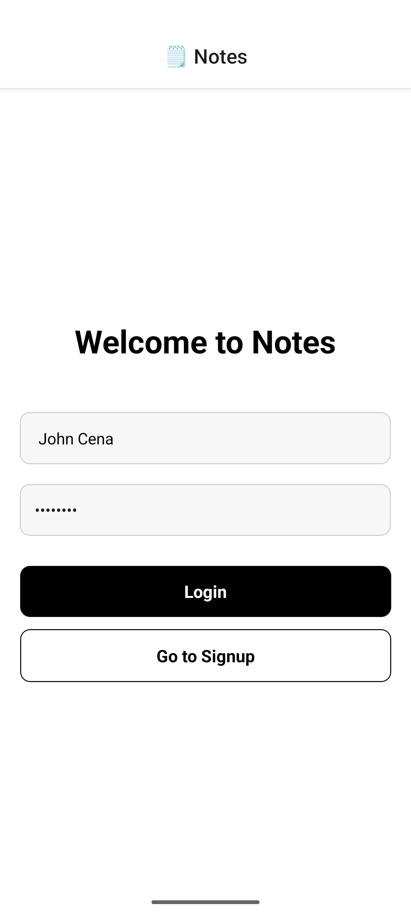
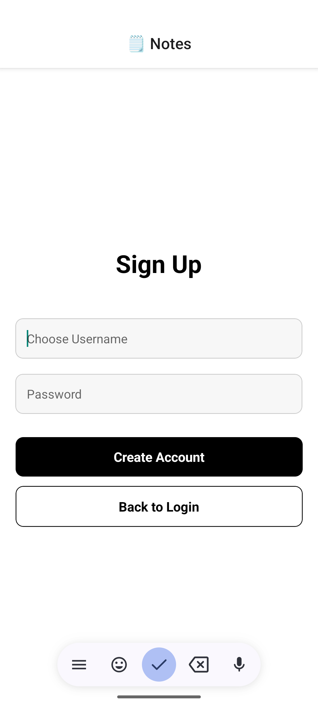
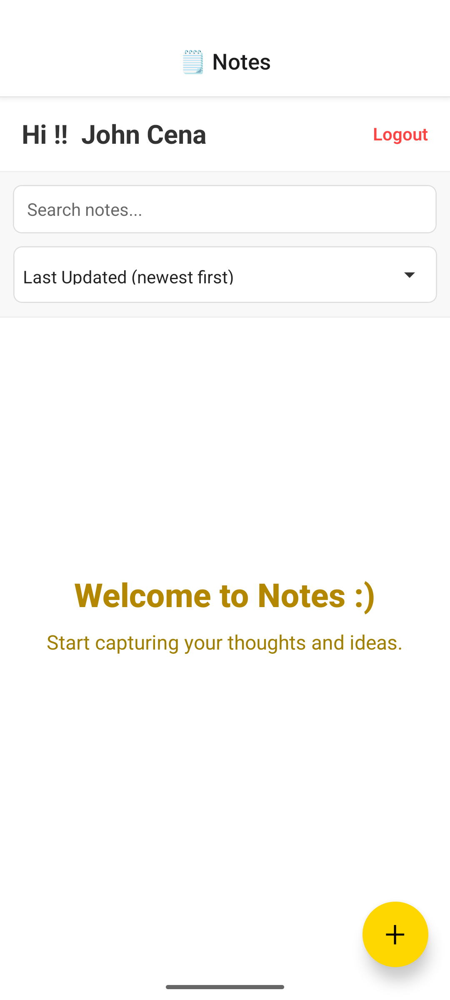
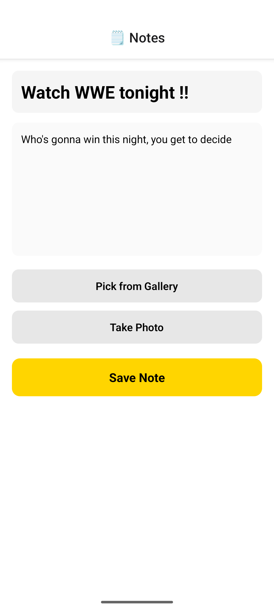
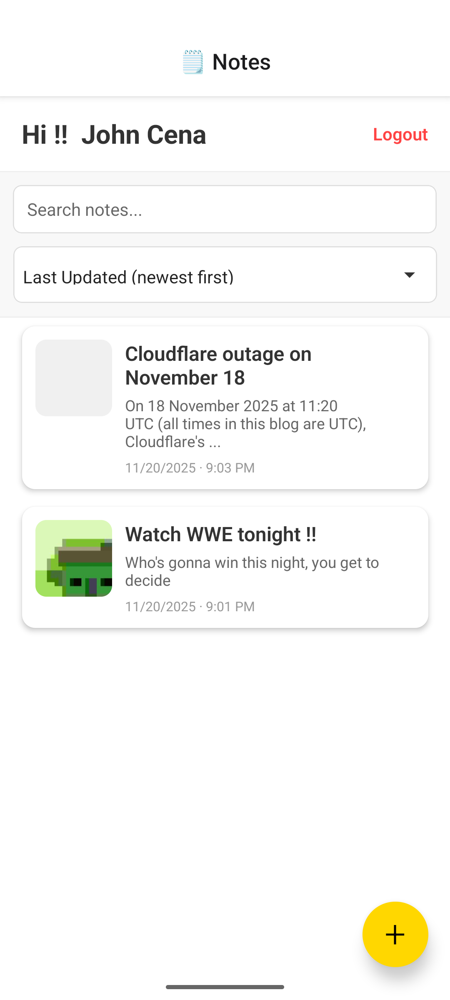
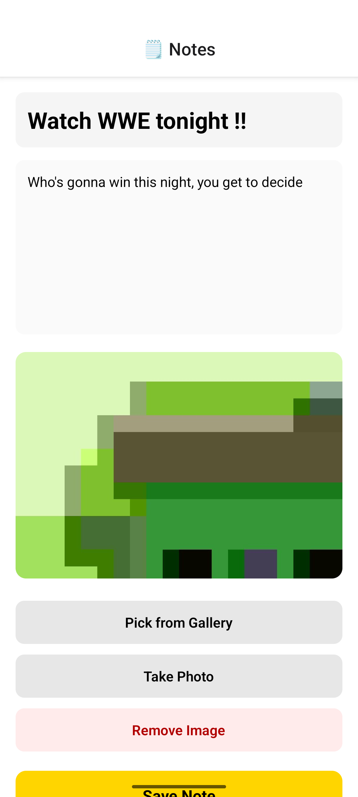

 # Offline Multi-User Notes App
 Offline React Native notes app with multi-user support, image attachments, search, sort per user.

 ## Features
 ✓ Offline-first – No internet required  
 ✓ Sign up / Login with username & password  
 ✓ Create, edit, delete notes with title, body & optional image  
 ✓ Pick image from gallery or take photo with camera  
 ✓ Search notes by title or body  
 ✓ Sort by: Last Updated (newest/oldest), Title A–Z / Z–A  
 ✓ Built with Zustand for simple, fast state management  
 ✓ All data stored locally using AsyncStorage


 ## Screenshots

 |                     |                   |
 |---------------------------------|-----------------------------------|
 |  |  |

 |                     |                 |
 |---------------------------------|-----------------------------------|
 |  |  |

 |                     |                 |
 |---------------------------------|-----------------------------------|
 |  |  |

 ## Setup & Run Instructions
 1. Run:
    ```bash
    npm install
    ```
 2. Then start the app:
    ```bash
    npx expo run:android
    ```
> !! Or you can just install the apk provided in the codebase [notes.apk]


 ## Libraries Used
 - React Native Expo
 - Zustand (state management)
 - AsyncStorage (local persistence)
 - expo-image-picker & expo-media-library (image support)
 - @react-native-picker/picker (sort dropdown)


 ## Known Issues / Incomplete Features
 - Account switching: Users must log out and log in again to switch accounts  
   (No "Switch User" menu yet – can be added later with a simple user list screen)
